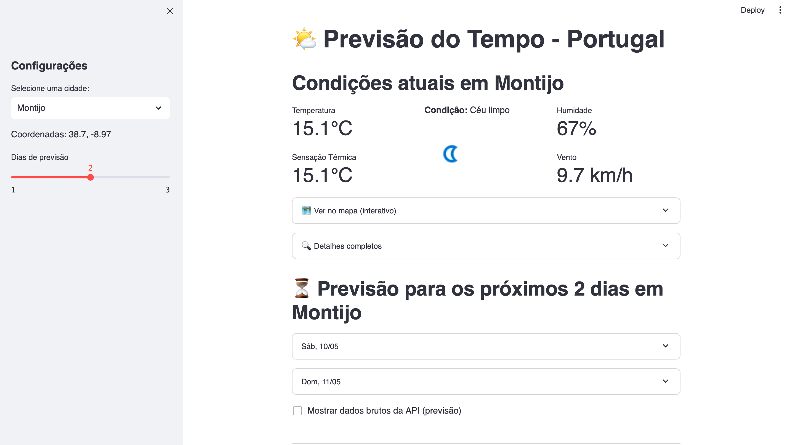

# 🌤️ Tempo Portugal - Previsão Meteorológica
[](https://tempo-portugal.streamlit.app)

Aplicação web para visualização da previsão do tempo em cidades portuguesas, com dados atualizados da API WeatherAPI.

<div align="center">
  <a href="https://tempo-portugal.streamlit.app" target="_blank">
    
  </a>
  <p><em>Clique na imagem para testar a aplicação</em></p>
</div>

## ✨ Funcionalidades

- Previsão atual detalhada (temperatura, humidade, vento)
- Previsão para 3 dias com:
  - Temperaturas máximas/mínimas
  - Probabilidade de chuva
  - Condições por hora
- Mapa interativo com localização
- Dados em português

## 🛠️ Tecnologias

- Python 3.10+
- Streamlit (interface web)
- WeatherAPI (dados meteorológicos)
- Folium (mapas interativos)
- Pandas (processamento de dados)

## 🚀 Como Executar Localmente

### Pré-requisitos
- Python 3.10+ instalado
- Conta na [WeatherAPI](https://www.weatherapi.com/) (plano free)

### Passo a Passo

1. Clone o repositório:
```bash
git clone https://github.com/seu-usuario/tempo-portugal.git
cd tempo-portugal
```

2. Crie e ative o ambiente virtual:
```bash
python -m venv .venv
source .venv/bin/activate  # Linux/Mac
# ou .\.venv\Scripts\activate (Windows)
```

3. Instale as dependências:
```bash
pip install -r requirements.txt
```

4. Configure as chaves de API:
```bash
mkdir -p .streamlit
echo '[WEATHER]' > .streamlit/secrets.toml
echo 'API_KEY = "sua_chave_aqui"' >> .streamlit/secrets.toml
```

5. Execute a aplicação:
```bash
streamlit run app.py
```

## 🌐 Como Fazer Deploy

1. **Streamlit Cloud** (Recomendado):
   - Conecte seu repositório GitHub
   - Adicione sua API Key em: Settings > Secrets

2. **Outras plataformas**:
   - Render, Heroku ou Hugging Face Spaces
   - Defina a variável de ambiente `WEATHER_API_KEY`

## 📝 Licença

Este projeto está licenciado sob a licença MIT - veja o arquivo [LICENSE](LICENSE) para detalhes.

## 🤝 Como Contribuir

1. Faça um Fork do projeto
2. Crie uma Branch (`git checkout -b feature/nova-feature`)
3. Commit suas Mudanças (`git commit -m 'Adiciona nova feature'`)
4. Push para a Branch (`git push origin feature/nova-feature`)
5. Abra um Pull Request

## 📬 Contato

**Mario Baeta** • [LinkedIn](https://www.linkedin.com/in/mariobaeta) <!-- Sem badge -->

> **Nota**: Dados meteorológicos fornecidos por [WeatherAPI](https://www.weatherapi.com/).
